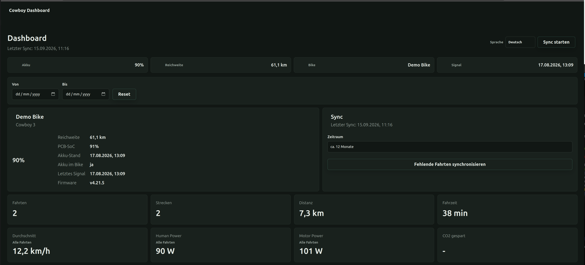
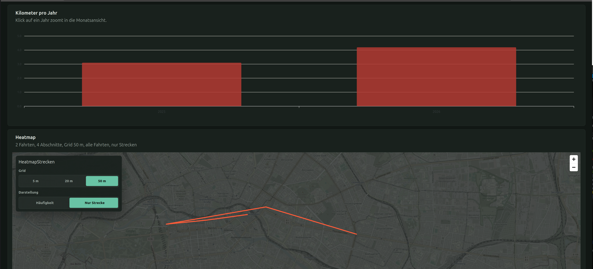
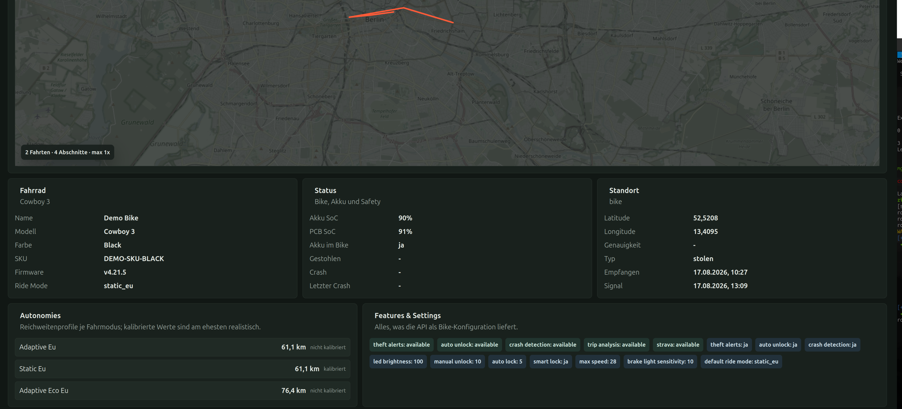

# Cowboy Dashboard

Local web dashboard for Cowboy bike data, ride statistics, and route heatmaps.

## Screenshots







## Stack

- Backend: Python, FastAPI, httpx
- Web UI: Vue 3, Vuetify, ApexCharts, MapLibre GL
- Storage: file based cache via `COWBOY_CACHE_DIR`
- Optional later: PostgreSQL

## Privacy And API Usage

This project is intended for self-hosting only. Do not run it as a hosted service for other users unless you fully understand the security implications: Cowboy credentials are submitted to the backend, so on a third-party hosted instance those credentials would be handled by that provider.

The app is designed to keep requests to Cowboy's official servers as low as possible:

- sync is manual, not triggered on every page load
- ride lists are synchronized incrementally after the first sync
- an overlap window is used so late updates can still be picked up
- trip chart and route data are cached locally and are not fetched again if already stored
- profile and bike responses are cached briefly
- credentials are kept server side and are not stored in browser storage

The local cache is application data and must not be committed. `cowboy-cache/`, `cowboy_cache/`, root-level exported JSON files, and old raw endpoint dumps are ignored by `.gitignore`.

## Development Note

AI assistance was used while creating parts of this project, including code, documentation, and UI iteration. The implementation should still be reviewed and tested before use with a real Cowboy account.

## Credits

Thanks to [`mmmago/cowboyheatmap`](https://github.com/mmmago/cowboyheatmap). This project uses its Cowboy heatmap approach as the basis for the route heatmap implementation.

## Cowboy API

The Cowboy endpoints were derived from these reference projects:

- `https://github.com/sam-dumont/cowboybike-strava-sync/tree/main/src`
- `https://github.com/mmmago/cowboyheatmap`

Relevant endpoints:

```text
POST /auth/sign_in
GET  /users/me
GET  /bikes/{bike_id}
GET  /users/me/places
POST /users/me/push_token
GET  /trips
GET  /trips/{trip_id}
GET  /trips/{trip_id}/charts
```

The client uses Android-app-like headers, including `X-Cowboy-App-Token`, `Client-Type: Android-App`, and `User-Agent: okhttp/4.9.3`.

See [COWBOY_API.md](./COWBOY_API.md) for endpoint notes and anonymized example payloads.

## Run With Docker Compose

The Docker images are also published as:

```text
badsmoke/cowboy-dashboard-api
badsmoke/cowboy-dashboard-web
```

The compose file keeps local `build` definitions and tags the services with these image names.

To build the images yourself and start the stack:

```bash
docker compose up -d --build
```

Or start the stack from already available images:

```bash
docker compose up -d
```

Then open:

- Web UI: `http://localhost:8080`
- Backend: `http://localhost:8000`
- Health: `http://localhost:8000/health`

Sign in through the Web UI with your Cowboy account. The backend keeps the session in memory.

## Reverse Proxy / HTTPS

For HTTPS deployments, put your reverse proxy in front of the web container and forward public traffic to port `8080` on the host, or to port `80` of the `cowboy-web` container on the Docker network.

The browser only talks to the web origin. All frontend API calls use relative `/api/...` paths, and the web container proxies those requests internally to the backend container. This means a public deployment can use a single HTTPS origin:

```text
https://dashboard.example.com/      -> Cowboy Dashboard web UI
https://dashboard.example.com/api/  -> Cowboy Dashboard backend API
```

Local deployment still works with `http://localhost:8080`; no reverse proxy is required for local use.

## Mock Mode

Use the in-process mock Cowboy API for development or tests:

```bash
COWBOY_MOCK_SERVER=true docker compose up --build
```

Truthy values are `true`, `1`, `yes`, and `on`.

When mock mode is enabled and the local store is empty, the backend seeds anonymized demo data automatically. A new developer can therefore open the dashboard and see trips, stats, and a heatmap without first calling the real Cowboy API.

If the app is later started with `COWBOY_MOCK_SERVER=false`, a local store marked as mock data is discarded automatically so demo trips are not shown in a real Cowboy session.

## Backend Endpoints

```text
GET  /health
GET  /api/health
POST /api/auth/login
POST /api/auth/logout
GET  /api/session
GET  /api/me
GET  /api/me/places
GET  /api/bikes/{bike_id}
POST /api/me/push_token
POST /api/sync/trips
GET  /api/trips
GET  /api/trips/{trip_id}
GET  /api/heatmap/geojson
GET  /api/heatmap/roads
GET  /api/metrics/overview
```

## Local Development

Backend:

```bash
python3 -m venv .venv
. .venv/bin/activate
pip install -r requirements.txt
uvicorn app.main:app --reload
```

Web UI:

```bash
cd web-ui
npm install
npm run dev
```

The Vite development UI runs at `http://localhost:5173` and proxies `/api` to the backend on port `8000`.
